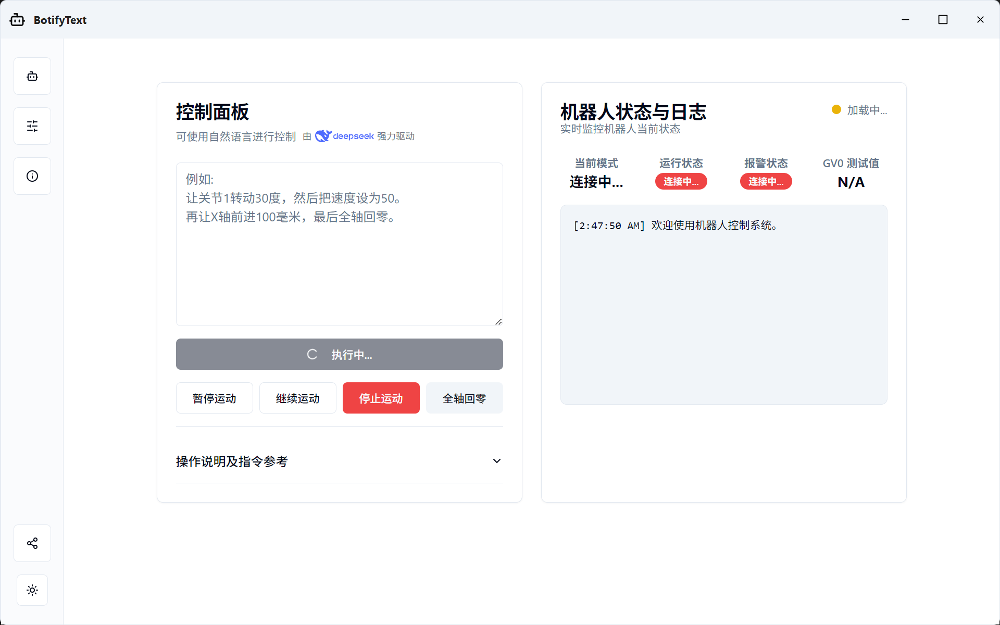

# BotifyText 🤖

**一个现代、直观、基于文本的机器人轨迹控制桌面应用。**

[](https://github.com/YOUR_USERNAME/BotifyText/releases)
[](LICENSE)

*将您想让机器人执行的动作，用简单的自然语言或指令写下来，`BotifyText` 会将其转化为精准的轨迹运动。*

---

 


## ✨ 主要特性

- **双模指令解析**：同时支持严格格式的指令和由大语言模型（LLM）驱动的自然语言解析。
- **现代化桌面体验**：使用 PySide6 和 Vue 3 构建，拥有自定义的、支持明暗主题同步的现代化UI。
- **动态配置**：所有关键参数（如机器人IP、速度、LLM API Key等）均可在应用内的设置界面动态修改。
- **跨设备Web访问**：内置Web服务器，允许在局域网内的其他设备上通过浏览器进行访问和控制。
- **打包分发**：使用 PyInstaller 打包，可生成单文件可执行程序，方便在Windows上分发和运行。

## 🛠️ 技术栈

- **后端**: Python, Flask, PySide6, pyserial
- **前端**: Vue 3 (Composition API), Vite, TypeScript, shadcn/vue, Tailwind CSS
- **桌面封装**: PySide6, PyInstaller
- **自然语言处理**: Deepseek API (可替换)


## 🚀 安装与使用 (面向普通用户)

1.  请前往本项目的 [**Releases**](https://github.com/xicheng2003/BotifyText/releases) 页面。
2.  下载最新版本的安装程序，例如 `BotifyText_v1.0.0_setup.exe`。
3.  双击运行安装程序，并根据向导提示完成安装。
4.  从桌面或开始菜单启动 `BotifyText` 即可！

## 👨‍💻 从源码构建 (面向开发者)

### 1. 克隆仓库
```bash
git clone [https://github.com/xicheng2003/BotifyText.git](https://github.com/xicheng2003/BotifyText.git)
cd BotifyText
```

### 2. 后端环境设置 (使用Conda)
```bash
# 创建并激活conda环境
conda create -n botify_text python=3.11 -y
conda activate botify_text

# 安装Python依赖
pip install -r requirements.txt 
# (提示：如果requirements.txt不存在或过时，请在激活环境下运行 pip freeze > requirements.txt 来生成)
```

### 3. 前端环境设置 (使用Node.js)
```bash
# 进入前端目录
cd frontend

# 安装Node.js依赖
npm install

# 构建前端静态文件
npm run build
```

### 4. 运行开发版应用
返回项目根目录，运行桌面应用启动脚本：
```bash
python run_desktop.py
```

### 5. 打包为可执行文件
```bash
# 确保您已安装PyInstaller: pip install pyinstaller
# 在项目根目录运行以下命令
pyinstaller run_desktop.py --name "BotifyText" --onefile --windowed --add-data "frontend/dist;frontend/dist" --add-data "backend/default_config.json;backend" --add-data "assets;assets" --icon="assets/bot_logo.ico" --version-file "version.txt"
```

### 6. 创建安装程序
```bash
# 确保您已安装Inno Setup
# 在项目根目录，右键点击 setup.iss 文件，选择 "Compile"
```

## 📝 开源许可

本项目基于 [MIT License](LICENSE) 开源。

## 🙏 致谢

* 本项目是广东工业大学的一项生产实习实训项目成果。
* 自然语言处理能力由 [Deepseek](https://www.deepseek.com) 强力驱动。
* 感谢所有项目合作成员 (Pei Zhijie, Liu Jinhang, Lin Taimin) 的贡献。
